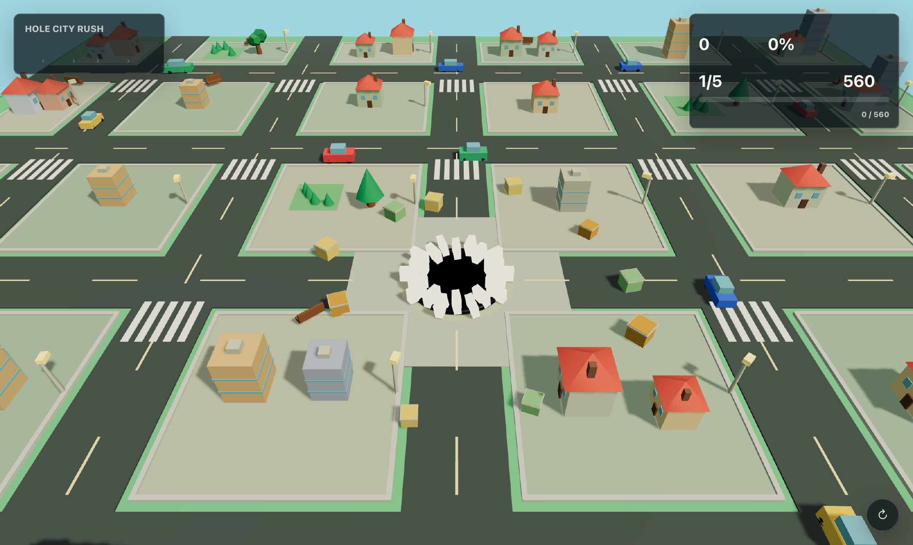

# Hole City Rush

작은 물건부터 흡수해 도시·메트로·행성·태양계를 지나 은하계까지 커지는 게임.

[브라우저에서 플레이](https://seowooyoo2014.github.io/hole-city-rush/) · [게임 방법](docs/gameplay.md) · [실행 방법](docs/running.md) · [아키텍처](docs/architecture.md) · [사용 기술](docs/technology.md) · [발전 히스토리](docs/history.md) · [검증](docs/verification.md) · [에셋](docs/assets.md)

## 화면

로컬 브라우저 실행 화면에서 촬영했습니다.

## 실행

`python3 -m http.server 8000`을 실행한 뒤 `/`를 엽니다. 시작 화면에서 영상 품질을 선택하고 시작합니다.
