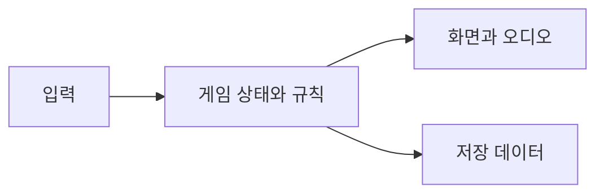

# 아키텍처

`index.html`이 `hole-city.css`와 `hole-city.js`를 로드합니다. 게임 코드는 Three.js 장면, 성장 단계, 입력·카메라, 최종전 전환을 관리합니다. 최종전 영상과 포스터는 `assets/cinematics/`에서 로드합니다.

```mermaid
flowchart LR
  I[입력] --> G[게임 상태와 규칙]
  G --> R[화면과 오디오]
  G --> S[저장 데이터]
```
